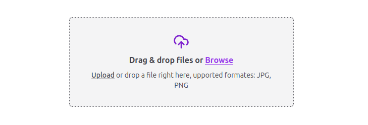
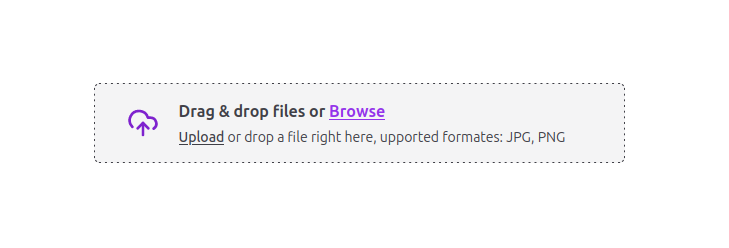

[](https://opensource.org/licenses/MIT)
[](https://badge.fury.io/js/react-drag-drop-upload)

# React Drag Drop Upload

React Drag Drop Upload is a lightweight library for uploading files and images with drag and drop, styled with Tailwind CSS and supporting customization.

# Installation

npm:

```bash
npm install react-drag-drop-upload
```

yarn:

```bash
yarn add react-drag-drop-upload
```

## Example

| large                                                                  | small                                                                  |
| ---------------------------------------------------------------------- | ---------------------------------------------------------------------- |
|  |  |

```tsx
import { useState } from "react";
import { ReactDragDropUpload } from "react-drag-drop-upload";

function App() {
  const [fileOrFilesData, setFileOrFilesData] = useState(null);
  // eslint-disable-next-line @typescript-eslint/no-explicit-any
  const handleChange = (data: any) => {
    setFileOrFilesData(data);
    console.log("handleChange", fileOrFilesData);
  };

  return (
    <div className="flex items-center justify-center h-screen w-screen">
      <ReactDragDropUpload
        handleChange={handleChange}
        className="border-zinc-700"
        types={["JPG", "PNG"]}
        multiple={false}
        variant="small"
      />
    </div>
  );
}

export default App;
```

# Features

- Drag and drop file upload
- Customizable components
- Supports Tailwind CSS for styling
- Error handling for file type and size

# API

### ReactDragDropUpload Component

A component for drag and drop file upload with customizable options.

#### Props

| Property              | Type                                                                  | Description                                              |
| --------------------- | --------------------------------------------------------------------- | -------------------------------------------------------- |
| name                  | string \| undefined                                                   | The name attribute for the input element.input.          |
| messageSuccess        | string \| undefined                                                   | The success message displayed after the upload.          |
| messageError          | string \| undefined                                                   | The error message displayed if the upload fails.         |
| variant               | "large" \| "small" \| undefined                                       | The variant of the component. Can be "large" or "small". |
| hoverTitle            | string \| undefined                                                   | The title displayed when hovering over the drop zone.    |
| types                 | Array<string> \| undefined                                            | An array of allowed file types.                          |
| className             | string \| undefined                                                   | The custom class for styling.                            |
| children              | (props: ChildrenUploaderProps) => ReactNode \| ReactNode \| undefined | The component's custom rendering function.               |
| maxSize               | number \| undefined                                                   | The maximum file size allowed in bytes.                  |
| minSize               | number \| undefined                                                   | The minimum file size allowed in bytes.                  |
| fileOrFiles           | Array<File> \| File \| null \| undefined                              | The currently selected file or files.                    |
| disabled              | boolean \| false \| undefined                                         | Indicates whether uploading is disabled.                 |
| label                 | string \| React.ReactElement \| undefined                             | The label for the file input.                            |
| description           | string \| React.ReactElement \| undefined                             | The description for the file input.                      |
| multiple              | boolean \| false \| undefined                                         | Allows multiple files to be uploaded.                    |
| required              | boolean \| false \| undefined                                         | Indicates whether the input is mandatory.                |
| onSizeError           | (arg: string) => void \| undefined                                    | Callback function for size errors.                       |
| onTypeError           | (arg: string) => void \| undefined                                    | Callback function for type errors.                       |
| onDrop                | (arg: File \| Array<File>) => void \| undefined                       | Callback function when files are dropped.                |
| onSelect              | (arg: File \| Array<File>) => void \| undefined                       | Callback function when files are selected.               |
| handleChange          | (arg: File \| Array<File> \| File) => void \| undefined               | Callback function when files are selected or dropped.    |
| onDraggingStateChange | (dragging: boolean) => void \| undefined                              | Callback function for dragging state changes.            |
| unstyled              | Boolean \| undefined                                                  | Remove component styles                                  |

### ChildrenUploaderProps Interface

The `ChildrenUploaderProps` interface describes the properties expected by the `ReactDragDropUpload` component.

| Property    | Type                                      | Description                                                   |
| ----------- | ----------------------------------------- | ------------------------------------------------------------- |
| dragging    | boolean                                   | Indicates whether a file is being dragged over the drop area. |
| error       | boolean                                   | Indicates if an error occurred during the upload.             |
| currFiles   | File[] \| File \| null                    | The currently selected file or files.                         |
| types       | Array<string> \| undefined                | An array of allowed file types.                               |
| minSize     | number \| undefined                       | The minimum allowed file size in bytes.                       |
| maxSize     | number \| undefined                       | The maximum allowed file size in bytes.                       |
| uploaded    | boolean                                   | Indicates whether the file was uploaded successfully.         |
| label       | string \| React.ReactElement \| undefined | The label for the file input.                                 |
| description | string \| React.ReactElement \| undefined | The description for the file input.                           |
| disabled    | boolean \| undefined                      |

#### Usage

```tsx
<ReactDragDropUpload
  name="file"
  types={["jpg", "png"]}
  maxSize={1024 * 1024 * 5} // 5MB
  onSizeError={(error) => console.log(error)}
  onTypeError={(error) => console.log(error)}
  onDrop={(files) => console.log("Files dropped:", files)}
>
  {({ currFiles, uploaded, error, disabled, label, types, maxSize, minSize }) => (
    // Custom rendering based on file upload state
    // e.g., show current file, upload progress, error messages, etc.
  )}
</ReactDragDropUpload>
```

### UploadWrapper Component

A styled wrapper for the file upload component.

#### Props

- disabled?: boolean
- \ - Indicates whether uploading is disabled.
- variant?: "large" | "small" - The variant of the component. Can be "large" or "small".
- uploaded?: boolean - Indicates whether the file was uploaded successfully.
- error?: boolean - Indicates whether an error occurred during the upload.

#### Usage

```tsx
<UploadWrapper>{/* Render file upload components here */}</UploadWrapper>
```

### DescriptionWrapper Component

A wrapper component for the file upload description.

#### Props

- error: boolean - Indicates if there is an error with the uploaded file.

#### Usage

```tsx
<DescriptionWrapper>
  {/* Render file description components here */}
</DescriptionWrapper>
```

### Description Component

A component to display the file upload description.

#### Props

- disabled: boolean | undefined
- \ - Indicates whether uploading is disabled.
- label?: string | React.ReactElement - The label for the file input.
- description?: string | React.ReactElement - The description for the file input.
- currFile: File | File\[\] | null - The currently selected file or files.
- uploaded: boolean | undefined - Indicates whether the file was uploaded successfully.
- types?: Array - An array of allowed file types.
- variant: "large" | "small" - The variant of the component. Can be "large" or "small".
- messageSuccess?: string - The success message displayed after the upload.

#### Usage

```tsx
<Description
  disabled={false}
  label="Upload file"
  currFile={selectedFile}
  uploaded={true}
/>
```

### DrawTypes Component

A component to display the allowed file types and size limits.

#### Props

- types?: Array - An array of allowed file types.
- minSize?: number - The minimum allowed file size in bytes.
- maxSize?: number - The maximum allowed file size in bytes.

#### Usage

```tsx
<DrawTypes types={["jpg", "png"]} minSize={1024} maxSize={1024 * 1024} />
```

## License

This library is licensed under the [MIT](https://choosealicense.com/licenses/mit/) license. See the LICENSE file for details.

## Contributing

Feel free to contribute to this project by submitting issues or pull requests on GitHub.
